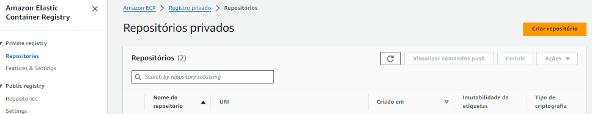
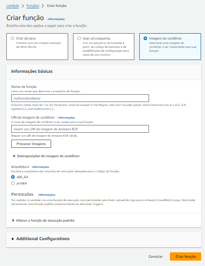
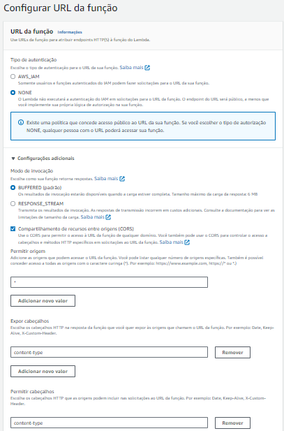
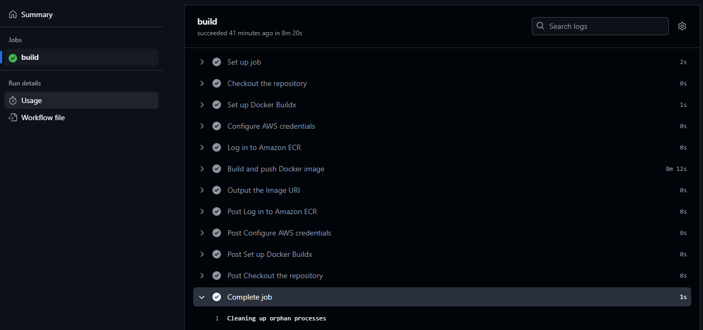
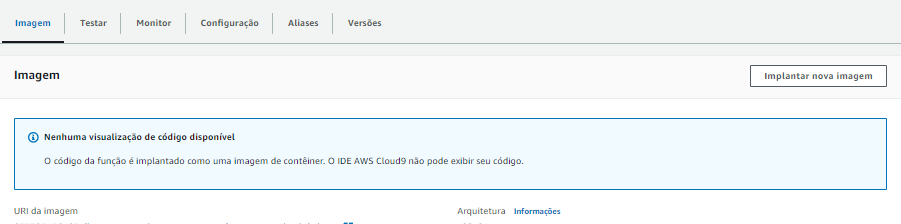
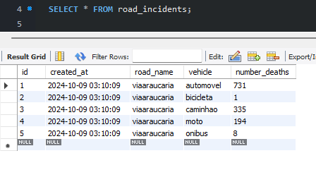

# Embarca Challenge Test - DevOps Project

Este projeto envolve a criação de uma arquitetura DevOps utilizando tecnologias como **Python**, **Docker**, **AWS Lambda**, **ECR**, **S3** e **RDS (MySQL)**.

**Clone este repositório na sua máquina e siga as instruções a seguir**.

As actions do Github será acionado apenas se houver atualizações no diretório **docker-lambda-image-custom**.

**Resumo do projeto**:
- **Função Lambda Gatilho**: docker-lambda-image-custom/app/**lambda_function.py**
- Fluxo das execuções: **lambda_handler** aciona de forma **sincronanizada** as funções **Lambda 1** e **Lambda 2**.
- *Lambda 1*: recebe a url do arquivo .csv e salva no bucket S3
- *Lambda 2*: obtem o arquivo salvo no S3, realiza o tratamento do .csv, calcula as métricas e aciona a função para salvar o registro no MySQL (RDS)
- *Final da Pipeline*: a função **Lambda 2** aciona **save_metrics_to_db** que recebe as **métricas** (json) e o **road_name** ("nome da estrada") e, realiza o UPDATE/CREATE dos registros no banco de dados
- *resposta HTTP*: após finalizar o pipeline a saída esperada é statusCode 200 e o body informando sucesso para Lambda 2 e fluxo do database. 

**Observações**: 
Customizei para este projeto as seguintes configurações da função Lambda:
- **CPU**: 300MB
- **Armazenamento temporário**: 600MB
- **Tempo Limite**: 0min e 25seg
- Aumentar esses valores se necessário para processamento de arquivos maiores.

## Arquivos Principais de Configuração:

### Docker:
- **Dockerfile**: Localizado em `docker-lambda-image-custom/Dockerfile`, contém as instruções para a criação da imagem Docker usada na função Lambda.
  - O arquivo está detalhadamente comentado para facilitar o entendimento de cada passo.

### GitHub Actions:
- **Pipeline CI/CD**: Arquivo `.github/workflows/ecr-deploy.yml` contém o pipeline que faz o build e deploy da imagem Docker para o Amazon ECR.
  - Comentários detalhados explicam cada parte da configuração.

### Banco de Dados MySQL:
- **Tabela road_incidents**: Arquivo `road_incidentes.sql` contém exemplo de tabela a ser utilizada neste projeto.

### Variáveis de ambiente (Função Lambda):
- na função Lambda vá em **Configuração**
- selecione a opção **variáveis de ambiente**
- adicione os seguintes valores de ambiente:
<table>
    <thead>
    <tr>
        <th>Chave</th>
        <th>Valor</th>
    <tr>
    </thead>
    <tr>
        <td>bucket_name</td>
        <td>****nome_do_bucket_AWS_S3****</td>
    </tr>
    <tr>
        <td>database</td>
        <td>****nome_do_banco_de_dados****</td>
    </tr>
    <tr>
        <td>host</td>
        <td>****host_do_banco_de_dados****</td>
    </tr>
    <tr>
        <td>password</td>
        <td>****senha_do_bando_de_dados****</td>
    </tr>
    <tr>
        <td>port</td>
        <td>3306</td>
    </tr>
    <tr>
        <td>user</td>
        <td>root</td>
    </tr>
    <tbody>
    </tbody>
</table>

## Pré-requisitos

1. **Conta AWS**: É necessário ter acesso a uma conta AWS para utilizar serviços como ECR, Lambda e RDS.
2. **Chaves de Acesso AWS**: Você precisará das chaves de acesso (`AWS_ACCESS_KEY_ID` e `AWS_SECRET_ACCESS_KEY`) que podem ser geradas no serviço IAM.
3. **Docker**: Instale Docker em sua máquina para testar e construir imagens localmente.
4. **GitHub Actions**: Configurado no repositório para CI/CD.

## Configuração das Chaves AWS no GitHub Actions

1. No repositório GitHub, vá em **Settings**.
2. Na seção **Security**, clique em **Secrets and variables** e selecione **Actions**.
3. Clique em **New repository secret** e adicione:
   - `AWS_ACCESS_KEY_ID`: A chave de acesso da sua conta AWS.
   - `AWS_SECRET_ACCESS_KEY`: A chave secreta da sua conta AWS.

Essas chaves podem ser obtidas no console da AWS em **IAM > Credenciais de segurança > Chaves de acesso**.

## Etapa 1 - Criar Repositório AWS ECR (Container)

1. No console AWS, busque por **ECR**.
2. Crie um novo repositório, fornecendo um nome claro e conciso.
3. Selecione a opção **Mutable** para permitir a atualização das imagens.
4. Escolha a criptografia **AES-256**.
5. Clique em **Criar**.

Após um **push** para a branch `main`, o pipeline do GitHub Actions será acionado para fazer o build e enviar a imagem Docker para o ECR.

### Exemplo visual da criação de um repositório ECR:

## Etapa 2 - Criar Função AWS Lambda

1. No console AWS, busque por **Lambda**.
2. Clique em **Criar função**.
3. Escolha a opção **Imagem de container**.
4. Nomeie a função de maneira descritiva.
5. Insira a **URI** da imagem Docker do ECR.
6. Escolha a arquitetura **x86_64**.
7. Clique em **Criar função**.

### Exemplo visual da criação da função Lambda:

## Etapa 3 - Configurar URL da Função Lambda

1. Dentro da função Lambda, vá em **Configuração** e selecione **URL da função**.
2. Clique em **Criar** ou **Editar** para adicionar uma URL.
3. Configure o CORS conforme necessário (neste projeto foi usado `*` para aceitar todas as origens).
4. Clique em **Criar URL**.

### Exemplo visual da configuração da URL da função Lambda:

## Etapa 4 - Executar o Pipeline de Build e Deploy no GitHub Actions

1. O pipeline é acionado automaticamente após um **push** na branch `main`.
2. Certifique-se de que os arquivos no diretório `docker-lambda-image-custom` foram modificados para acionar o build.

### Exemplo de execução bem-sucedida no GitHub Actions:

## Etapa 5 - Atualizar a Imagem no AWS Lambda

1. Após a conclusão do build, vá para a função Lambda.
2. Atualize a função com a nova imagem Docker gerada.
3. **Importante**: Certifique-se de que a URI da imagem no ECR está correta ou simplesmente clique em **Salvar** para aplicar a nova imagem.

### Exemplo visual de atualização da função Lambda com a nova imagem:

## Etapa 6 - Consumindo Função Lambda

1) método POST para URL da função Lambda 
2) adicione no headers a chave "Content-Type" com o valor "application/json" 
3) adicione no body da requisição o modelo JSON abaixo (deve enviar como string):

input:

<pre>
<code>
{
  "csv_url": "https://dados.antt.gov.br/dataset/ef0171a8-f0df-4817-a4ed-b4ff94d87194/resource/aa60ce3a-033a-4864-81dc-ae32bea866e5/download/demostrativo_acidentes_viaaraucaria.csv"
}
</code>
</pre>

output esperado:

<pre>
<code>
{
    "message": "success lambda 2",
    "metrics": {
        "total_geral": 1269,
        "automovel": 731,
        "bicicleta": 1,
        "caminhao": 335,
        "moto": 194,
        "onibus": 8
    },
    "db_process": {
        "status": "success",
        "message": "Metrics saved successfully"
    }
}
</code>
</pre>

## Etapa 7 - Atualização do Bando de Dados MySQL

1. Após a conclusão do build, vá para a função Lambda.
2. Atualize a função com a nova imagem Docker gerada.
3. **Importante**: Certifique-se de que a tabela **road_incidents** esteja criada corretamente no banco de dados.
4. Tabela de exemplo no arquivo **road_incidentes.sql**

### Exemplo visual dos registros inseridos no banco MySQL:

